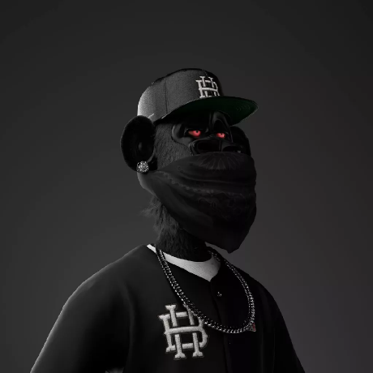

```
➜ ./jwne/readme.md ~ git:(master) ✗ screen neofetch
```
```md
| jwne@github
| ------------
| 
| 📧・weloveroots@protonmail.com.
| 📝・420 Years old.
| 🏴・BOTNET.
            
➜ ./jwne/readme.md ~ git:(master) ✗ tree
.
├── Learning
│   ├── Golang
│   ├── Cpp
│   └── C
|
├── Backend_Dev.txt
└── social_media.md

➜ ./jwne/readme.md ~ git:(master) ✗ cat social_media.md
"""
  ・Twitter    -> twitter.com/crudities
  ・GitHub     -> github.com/jwne
  ・Telegram   -> t.me/lilb2012
"""  
➜ ./jwne/readme.md ~ git:(master) ✗ 
```

-----

<p align="center">
  
  
  
</p>
